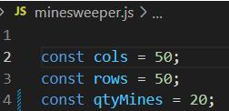

# Minesweeper-js

## Copy minesweeper is written on JS
___

This is a copy of the game that was developed back in the 90s. The goal of the game is to find all the mines on the map, which consists of cells, behind each of which there may be a surprise. In the search for mines, numbers will help us, which will signal us how many mines are located in the area of ​​8 cells around us.

You can embed this copy of the legendary game on your site. Different from the original, you can change the size of the map and the number of mines to any value just by replacing 3 parameters 

## Example work

___

 

___

